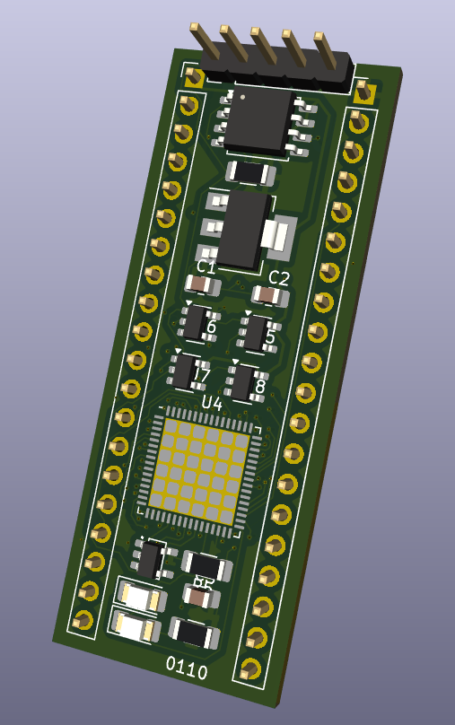
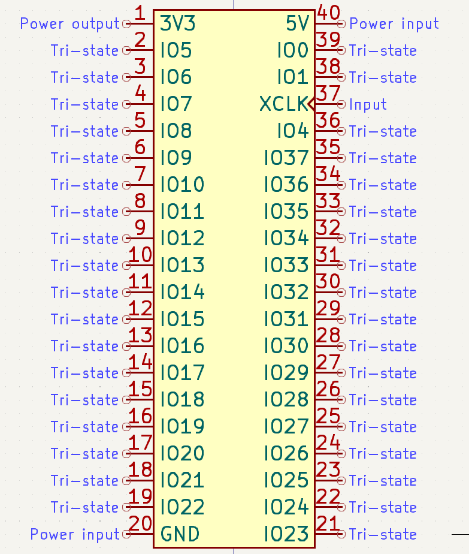
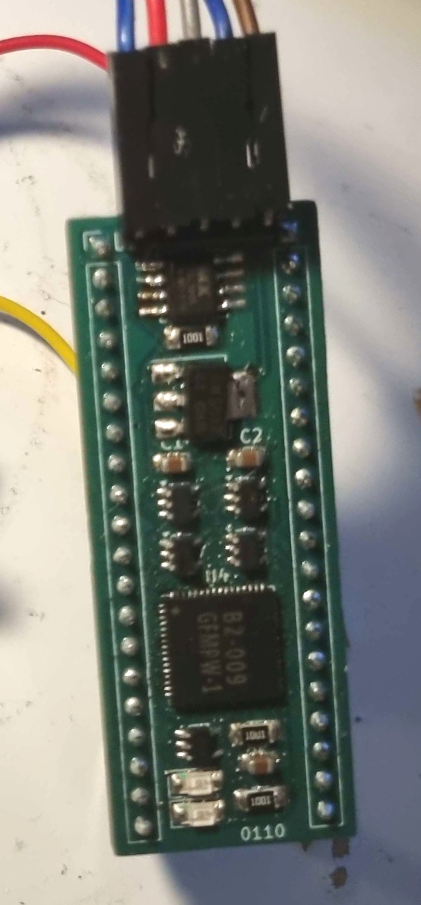
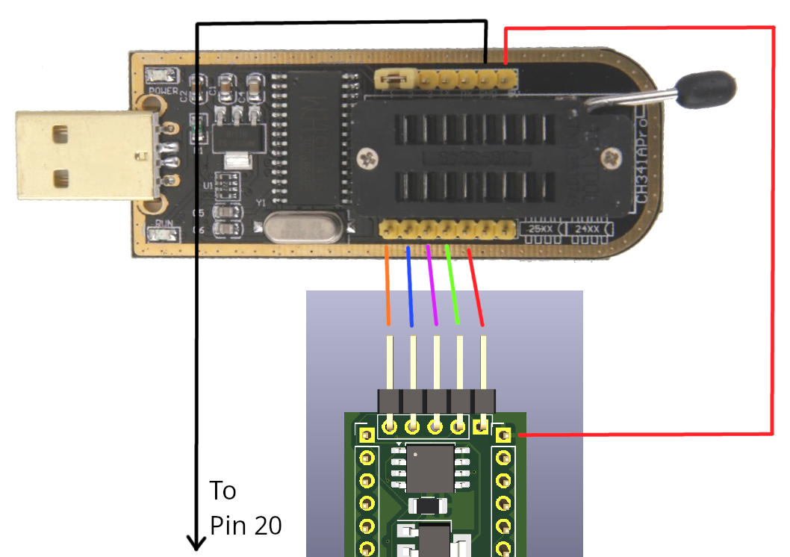

# gfmpw-breakout
This repo contains all the files, including production-ready gerber files, for this PCB:

It contains all components on-board to keep the caravel management controller happy and breaks out the user IO lines into the same footprint as a DIP-40 IC. The board is meant for both prototyping, i.e. on a breadboard, or use as a module on another PCB.

Specifically, it has:

 - Space for any GFMPW IC
 - Spiflash IC for mangement controller firmware, plus required level shifters and 3.3V voltage regulator
 - Programming header for SPI flash
 - Power-on reset circuitry
 - LED on ``gpio``
 - Breakouts for pins ``mprj_io[37:5]`` as well as ``mprj_io[0]``, ``mprj_io[1]`` and ``mprj_io[4]``

Note: the board does not have the capability to program the 25Q32 spiflash in-place. To program it, any number of portable ROM programmers can be used, such as the [CH341A](https://www.amazon.com/Programmer-Module-CH341A-Burner-5V-3-3V/dp/B07PFCJ8G9) (I recommend this device as it is supported by the `flashrom` utility on most Linux distros) and wire the programming header to it.

The pinout of the board is as such (a KiCad symbol is [also available](board_symbol.kicad_sym)):

Note that 3V3 is a output from the on-board voltage regulator. The only power input is 5V.

To edit the KiCad files, you will need to add the ``Caravel_Board.pretty`` footprint files from the efabless/caravel_board repo, which can be obtained [here](https://github.com/efabless/caravel_board/tree/main/hardware/footprints/Caravel_Board.pretty).

# BOM

| Designator(s) | Value       | TME # | Mouser # |
|---------------|-------------|-------|----------|
| U1         | AMS1117-3.3 | AZ1117H-3.3TRE1 | 595-REG1117-3.3 |
| U2         | 25Q32 or compatible       | MX25L1006EMI-10G | 454-W25Q32JVSSIMTR |
| U3         | MCP1319MT | MCP1319MT-29LT | 579-MCP1319MT29LE/OT |
| U4         | GFMPW IC | N/A | N/A |
| U5, U6, U7, U8 | SN74LV1T126 | - |  595-74LV1T126QDBVRQ1 |
| D1, D2 | LED 1206 (metric 3216) | 24-21SURC/S530-A2 | 630-HSMH-H150 |
| R4, R5, R6 | 1K 1206 (metric 3216) | 1206S4F1001T5E | 71-RCA12061K00JNEA |
| C1, C2, C3 | 1µF 0805 (metric 2012) | 08053C105J4T2A | 810-CGA4J3X7R1H105MS |

Assembled board should look like this:

After building, the programmer hookup (CH341A) is like follows. This may even work for in-system programming, but the programmer powers the board, so its intended to be a standalone setup.
Note that connecting the programmer holds caravel in reset until the physical connections to the programmer are disconnected.

