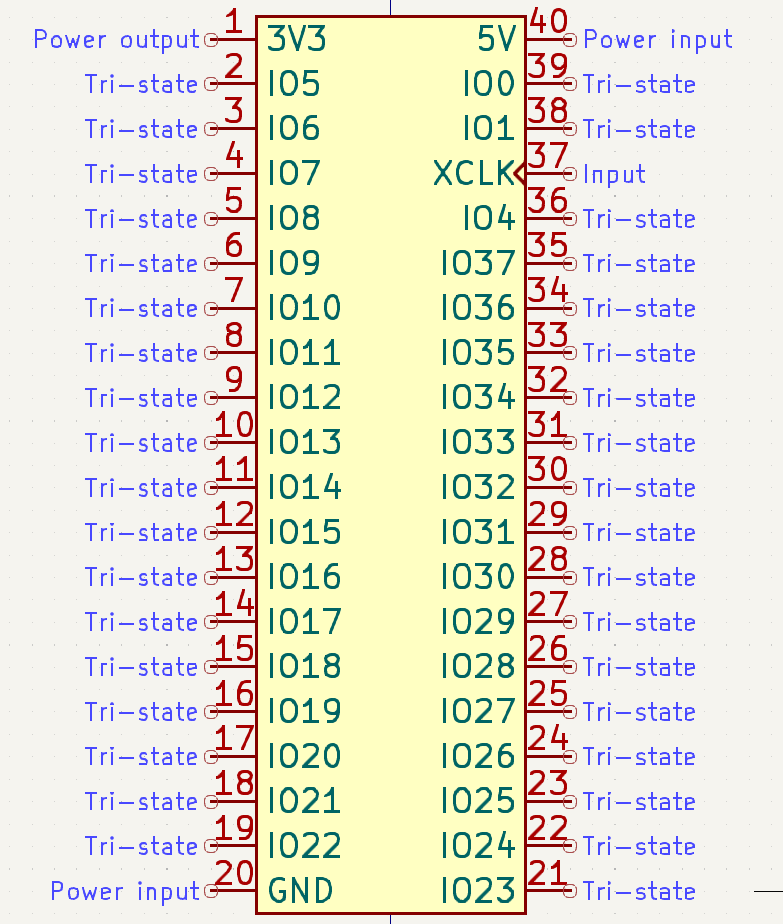

# gfmpw-breakout
This repo contains all the files, including production-ready gerber files, for this PCB:

It contains all components on-board to keep the caravel management controller happy and breaks out the user IO lines into the same footprint as a DIP-40 IC. The board is meant for both prototyping, i.e. on a breadboard, or use as a module on another PCB.

Specifically, it has:

 - Space for any GFMPW IC
 - Socket for spiflash IC containing mangement controller firmware, plus required level shifters and 3.3V voltage regulator
 - Power-on reset circuitry
 - LED on ``gpio``
 - Breakouts for pins ``mprj_io[37:5]`` as well as ``mprj_io[0]``, ``mprj_io[1]`` and ``mprj_io[4]``

Note: the board does not have the capability to program the 25Q32 spiflash in-place. You will need to solder it to a breakout board such as [this](https://protosupplies.com/product/pcb-smd-soic-8-msop-8-tssop-8-to-dip-adapter5-pack/) and socket it using female headers on the GFMPW breakout. To program it, any number of portable ROM programmers can be used, such as the [CH341A](https://www.amazon.com/Programmer-Module-CH341A-Burner-5V-3-3V/dp/B07PFCJ8G9).

The pinout of the board is as such (a KiCad symbol is [also available](https://example.com/):

Note that 3V3 is a output from the on-board voltage regulator. The only power input is 5V.
